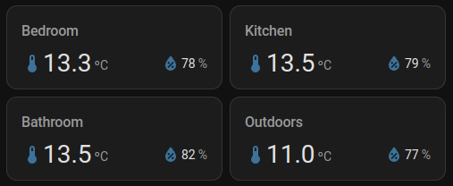

# Hass Custom Cards

A small collection of varied custom cards, grouped together for convenience and size.

## Setup

We recommend using HACS:

## Configuration

Check the details for each specific card:

- [Events Card](./docs/events-card.md): Show binary sensor activity without clutter
- [Sprinklers Card](./docs/sprinklers-card.md): Manage your EspHome Sprinklers system
- [Temperature Humidity Card](./docs/temperature-humidity-card.md): Show temperature and humidity in a single card
- [Top Power Card](./docs/top-power-card.md): Show power consumption, sorting by value, to see the biggest consumers at a glance
