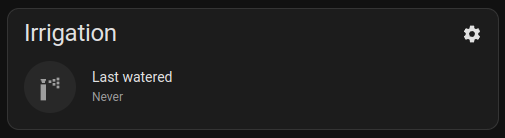
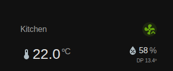

# Hass Custom Cards

A small collection of varied custom cards, grouped together for convenience and size.

## Setup

We recommend using HACS:

## Configuration

Check the details for each specific card:

- [Events Card](./docs/events-card.md): Show binary sensor activity without clutter
- [Sprinklers Card](./docs/sprinklers-card.md): Manage your EspHome Sprinklers system
- [Temperature Humidity Card](./docs/temperature-humidity-card.md): Show temperature and humidity in a single card
- [Top Power Card](./docs/top-power-card.md): Show power consumption, sorting by value, to see the biggest consumers at a glance
- [Weather Station Card](./docs/weather-station-card.md): Show a summary of your personal weather station

## Development

Run `yarn storybook` to open a [Storybook](https://storybook.js.org/) gallery at http://localhost:6006 — no Home Assistant instance needed. Each card has a story per interesting case (e.g. all 5 ventilation states for the temperature/humidity card), and every story exposes its actual sensor values — temperature, humidity, wind speed, etc. — as editable Controls, so you can try arbitrary values without touching any file. A `cardWidth` control on every story lets you check a card at any width, including a `Horizontal Stack Half` story approximating HA's own horizontal-stack layout (~242px, based on HA's ~492px column cap split with its 8px gap). The theme toggle in the toolbar switches between light/dark HA-like CSS variables.

Add stories in [dev/stories/](./dev/stories/) (one file per card). The mocked `hass` object and stand-in `ha-icon`/`ha-relative-time` elements live in [dev/mocks.ts](./dev/mocks.ts); icons are resolved from the full `@mdi/js` icon set, so any `mdi:` name used by a card renders without needing to add it by hand.
