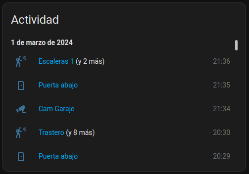

# Events Card

A custom card to show the latest events of a group of binary sensors, with grouping.



## Configuration

To add the card into your panel, add a custom YAML card of type `custom:events-card`.

Example configuration:

```yml
type: custom:events-card
title: Recent Activity
entities:
  - binary_sensor.sensor_kitchen_occupancy
  - binary_sensor.sensor_bedroom_occupancy
  - entity: binary_sensor.door_contact
    name: Front Door
    icon: mdi:door
    group: doors
```

A comprehensive list of available options is provided below:

| Field          | Required | Description |
|----------------|----------|-------------|
| title          | Yes      | Card title. |
| entities       | Yes      | List of entities to show. See below for details. |

Each entity can be either the sensor id, or an object with the following fields:

| Field          | Required | Description |
|----------------|----------|-------------|
| entity         | Yes      | Entity ID. |
| name           | No       | Custom name to show for this entity. |
| icon           | No       | Custom icon to use for this entity. |
| group          | No       | Group key to group near events. |

The grouping makes that any number of events close in time, for entities in the same group,
will be shown as a single event, with a note indicating how many other events have been grouped with it.
This helps declutter the list, while keeping relevant information easily available.
