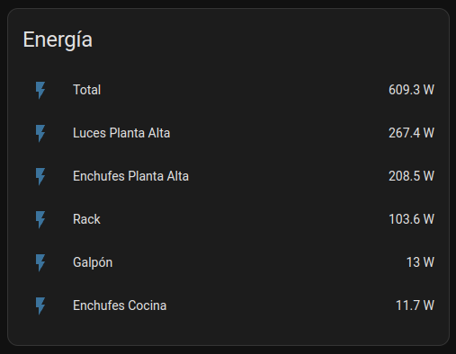

# Top Power Card

A custom card to show the top power consumption from a list of meters.



## Configuration

To add the card into your panel, add a custom YAML card of type `custom:top-power-card`.

Example configuration:

```yml
type: custom:top-power-card
total:
  entity: sensor.total_power
circuits:
  - entity: sensor.section1_power
  - entity: sensor.section2_power
  - entity: sensor.section3_power
limit: 5
idle_threshold: 5
high_threshold: 300

```

A comprehensive list of available options is provided below:

| Field          | Required | Description |
|----------------|----------|-------------|
| title          | No       | Card title override. |
| total          | Yes      | Sensor for total home consumption. See below for details. |
| circuits       | Yes      | List of circuits to show. See below for details. |
| limit          | No       | Max number of circuit to show (or 0 for unlimited). |
| idle_threshold | No       | Minimum to consider a circuit as "idle" (grayed out). |
| high_threshold | No       | Minimum to consider a circuit as "high power usage" (highlighted). |

For each circuit, the following options can be set:

| Field          | Required | Description |
|----------------|----------|-------------|
| entity         | Yes      | The entity providing this circuit's power usage. |
| name           | No       | Overrides the entity friendly name. |
| idle_threshold | No       | Minimum to consider this circuit as "idle" (grayed out). |
| high_threshold | No       | Minimum to consider this circuit as "high power usage" (highlighted). |

If a circuit has one or both thresholds set, those override the global ones. If none are set, the defaults are 5 for idle, and 300 for high.
