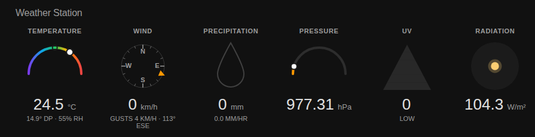

# Weather Station Card

A custom card to show a summary of your personal weather station, inspired by the Wunderground dashboard: temperature, wind, precipitation, pressure, UV and solar radiation at a glance, each with a small visual gauge.



## Configuration

To add the card into your panel, add a custom YAML card of type `custom:weather-station-card`.

Every field is optional except for the ones listed as required for each tile below — a tile is only rendered when its primary entity is configured, so you can pick whichever subset of tiles matches the sensors your station exposes.

Example configuration:

```yml
type: custom:weather-station-card
title: Weather Station
temperature: sensor.ws_temperature
dewpoint: sensor.ws_dewpoint
humidity: sensor.ws_humidity
wind_speed: sensor.ws_wind_speed
wind_gust: sensor.ws_wind_gust
wind_bearing: sensor.ws_wind_bearing
precipitation_rate: sensor.ws_precipitation_rate
precipitation_today: sensor.ws_precipitation_today
pressure: sensor.ws_pressure
uv: sensor.ws_uv
solar_radiation: sensor.ws_solar_radiation
```

A comprehensive list of available options is provided below:

| Field                     | Required | Description |
|---------------------------|----------|-------------|
| title                      | No       | Card title |
| temperature                | For temperature tile | Sensor for the current temperature |
| temperature_min            | No       | Lower bound of the temperature gauge (default `-10`) |
| temperature_max            | No       | Upper bound of the temperature gauge (default `40`) |
| dewpoint                   | No       | Sensor for the dew point, shown as a marker on the gauge and as secondary text |
| humidity                   | No       | Sensor for relative humidity, shown as secondary text |
| wind_speed                 | For wind tile | Sensor for the current wind speed |
| wind_gust                  | No       | Sensor for wind gust speed, shown as secondary text |
| wind_bearing                | No       | Sensor for wind direction in degrees, shown as an arrow on the compass |
| precipitation_rate          | For precipitation tile* | Sensor for the current precipitation rate, used to fill the drop gauge |
| precipitation_today         | For precipitation tile* | Sensor for today's accumulated precipitation, shown as the main value |
| precipitation_rate_max      | No       | Rate at which the drop gauge is considered full (default `10`, in the unit of `precipitation_rate`) |
| pressure                   | For pressure tile | Sensor for the current atmospheric pressure |
| pressure_min                | No       | Lower bound of the pressure gauge (default `970`) |
| pressure_max                | No       | Upper bound of the pressure gauge (default `1050`) |
| uv                          | For UV tile | Sensor for the current UV index |
| uv_max                      | No       | Value at which the UV gauge is considered at its maximum (default `11`) |
| solar_radiation              | For radiation tile | Sensor for the current solar radiation |
| solar_radiation_max          | No       | Value at which the radiation gauge is considered at its maximum (default `1000`) |

\* The precipitation tile is shown if either `precipitation_rate` or `precipitation_today` is set; provide both for the full display (accumulated total as the main value, current rate as secondary text and gauge fill).

Units are read from each sensor's own `unit_of_measurement`, so the card works with both metric and imperial stations.
